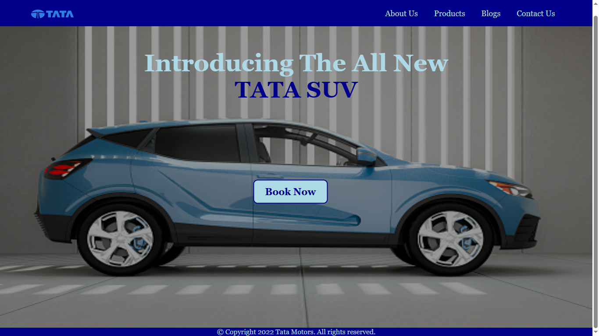

# 🚗 Tata Motors Landing Page using HTML & CSS


A simple Tata Motors inspired landing page built using pure HTML and CSS.  
This project demonstrates frontend fundamentals such as navigation bars, hero sections, overlays, positioning, hover effects, and responsive layout basics.

---

## 📌 Features

* Fixed navigation bar
* Hero banner with fullscreen background image
* Styled "Book Now" call-to-action button
* Hover effects for navigation links and buttons
* Dark overlay effect using CSS pseudo-elements
* Clean and beginner-friendly project structure
* Pure HTML and CSS implementation without frameworks

---

## 🚀 Tech Stack

* HTML5
* CSS3

---

## 🗂️ Project Structure

```text
tata-motors-landing-page/
│
├── Website.html
├── index.css
├── tata_logo.png
├── Car.jpg
└── README.md
```

---

## ⚙️ Page Sections

### 🧭 Navigation Bar

Contains:

* Tata Motors logo
* About Us link
* Products link
* Blogs link
* Contact Us link

---

### 🖼️ Hero Section

Displays:

* Fullscreen SUV background image
* Promotional heading
* CTA button

---

### 🎯 Call-To-Action Button

```html
<button>Book Now</button>
```

Styled using CSS hover transitions and color effects.

---

## 🎨 CSS Concepts Used

```css
display: flex;
position: fixed;
position: absolute;
transform: translate();
transition: all 0.3s ease;
```

Additional concepts:

* Flexbox layout
* Overlay effects using `::before`
* Hover animations
* CSS positioning
* Fullscreen background images

---

## ▶️ Running the Project

Simply open the HTML file in your browser.

### Option 1

Double-click:

```text
Website.html
```

### Option 2

Use VS Code Live Server extension.

---

## 📸 Screenshot



---

## 📚 Learning Outcomes

This project demonstrates:

* Basic webpage structure using HTML
* Styling webpages using CSS
* Flexbox-based navigation design
* Hero section creation
* CSS hover effects and transitions
* Positioning elements using absolute and fixed positioning

---

## 📌 Note

This project was created for practicing frontend web development fundamentals using only HTML and CSS without external libraries or frameworks.
